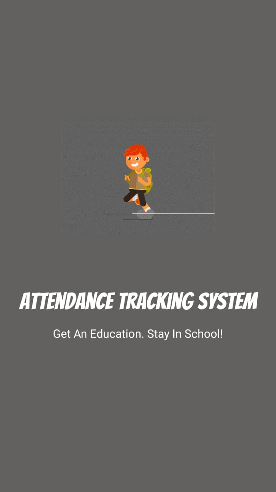
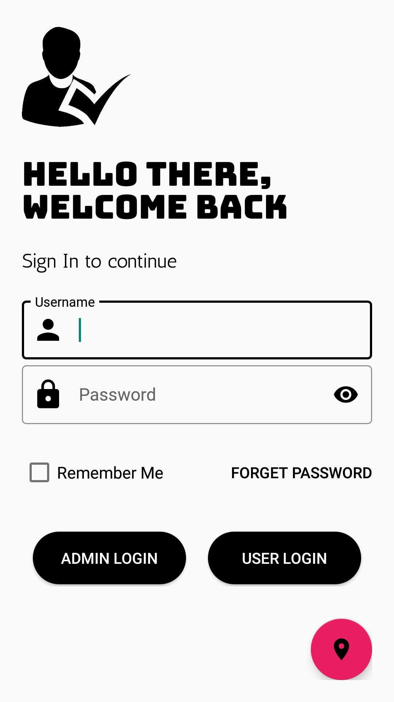
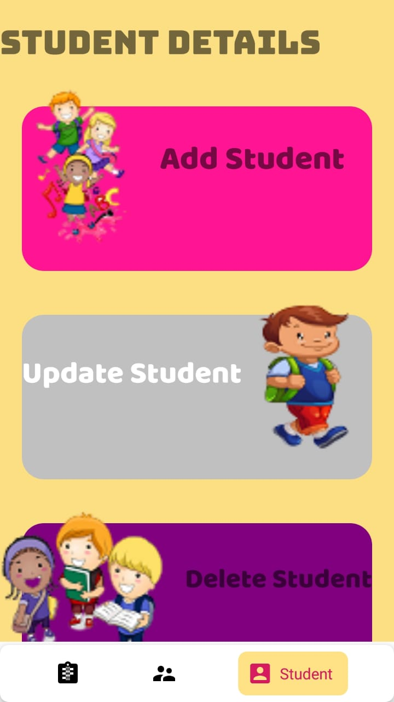
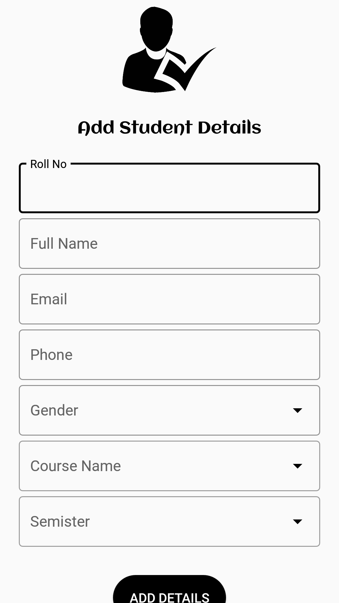
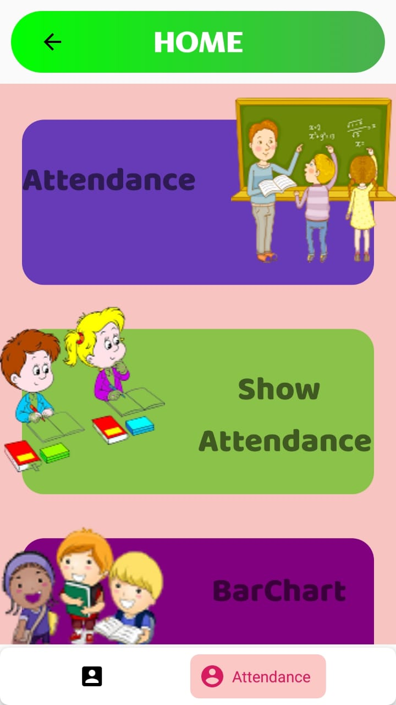
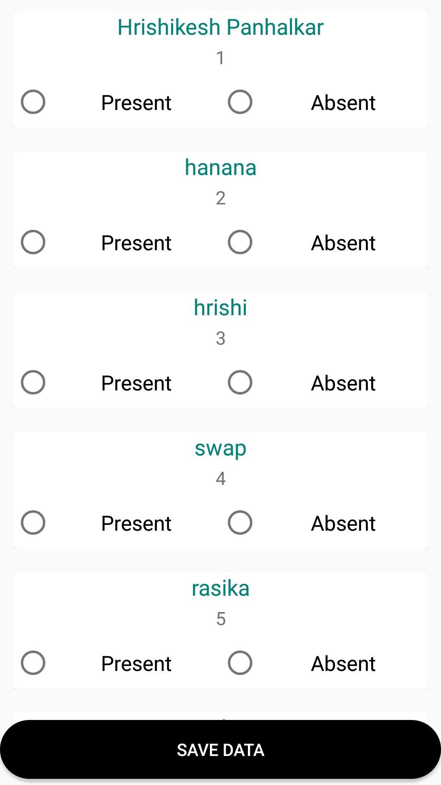
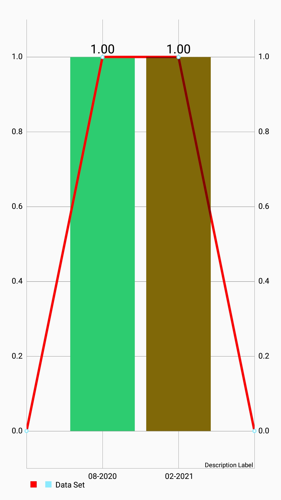
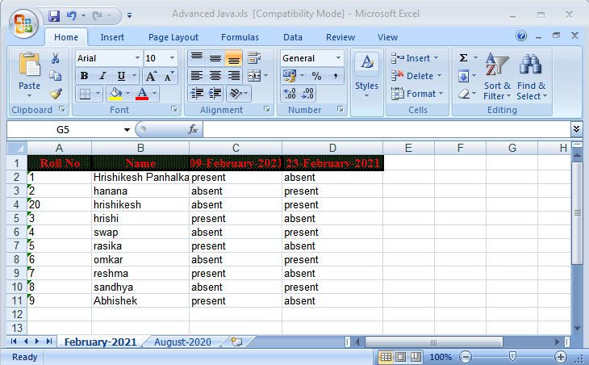
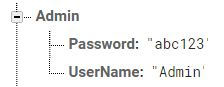

# AttendanceApp
This Mobile application is mainly designed to store attendance of each student and show graph of student’s attendance. This application designed using Android, Java as backend and Firebase database. All data store on cloud. 

<b> Notes: 1) Add your own google-services.json file 
           2) Add one below child in firebase realtime database with your username and password for admin.</b>
           
